# (2) 1.To create data base using DDL and DML statements

```
CREATE TABLE SAILORS
(
 SID NUMBER PRIMARY KEY,
 SNAME VARCHAR2(40),
 RATING NUMBER,
 AGE NUMBER (4,1)
);
CREATE TABLE BOATS
(
 BID NUMBER PRIMARY KEY,
 BNAME VARCHAR2(20),
 COLOR VARCHAR2(10)
 );
CREATE TABLE RESERVES
(
 SID NUMBER,
 BID NUMBER,
 DAY DATE
 );

INSERT INTO SAILORS VALUES (22,'DUSTIN',7,45.0);
INSERT INTO SAILORS VALUES (29,'BRUTUS',1,33.0);
INSERT INTO SAILORS VALUES (31,'LUBBER',8,55.5);
INSERT INTO SAILORS VALUES (32,'ANDY',8,25.5);
INSERT INTO SAILORS VALUES (58,'RUSTY',10,35.0);
INSERT INTO SAILORS VALUES (64,'HORATIO',7,35.0);
INSERT INTO SAILORS VALUES (71,'ZORBA',10,16.0);
INSERT INTO SAILORS VALUES (74,'HORATION',9,35.0);
INSERT INTO SAILORS VALUES (85,'ART',3,25.5);
INSERT INTO SAILORS VALUES (95,'BOB',3,63.5);

INSERT INTO BOATS VALUES (101,'INTERLAKE','BLUE');
INSERT INTO BOATS VALUES (102,'INTERLAKE','RED');
INSERT INTO BOATS VALUES (103,'CLIPPER','GREEN');
INSERT INTO BOATS VALUES (104,'MARINE','RED');

INSERT INTO RESERVES VALUES(22, 102, TO_DATE('10/10/98', 'DD/MM/YY'));
INSERT INTO RESERVES VALUES(22, 103, TO_DATE('10/08/98', 'DD/MM/YY'));
INSERT INTO RESERVES VALUES(22, 104, TO_DATE('10/07/98', 'DD/MM/YY'));
INSERT INTO RESERVES VALUES(31, 102, TO_DATE('11/10/98', 'DD/MM/YY'));
INSERT INTO RESERVES VALUES(31, 103, TO_DATE('11/06/98', 'DD/MM/YY'));
INSERT INTO RESERVES VALUES(31, 104, TO_DATE('11/12/98', 'DD/MM/YY'));
INSERT INTO RESERVES VALUES(64, 101, TO_DATE('09/05/98', 'DD/MM/YY'));
INSERT INTO RESERVES VALUES(64, 102, TO_DATE('09/08/98', 'DD/MM/YY'));
INSERT INTO RESERVES VALUES(74, 103, TO_DATE('09/08/98', 'DD/MM/YY'));

```
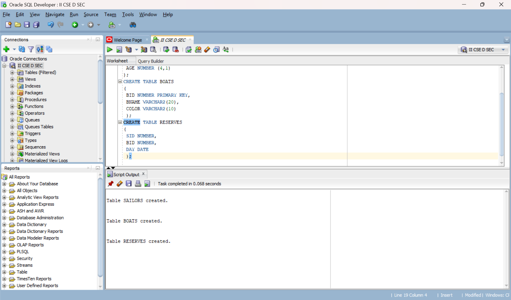
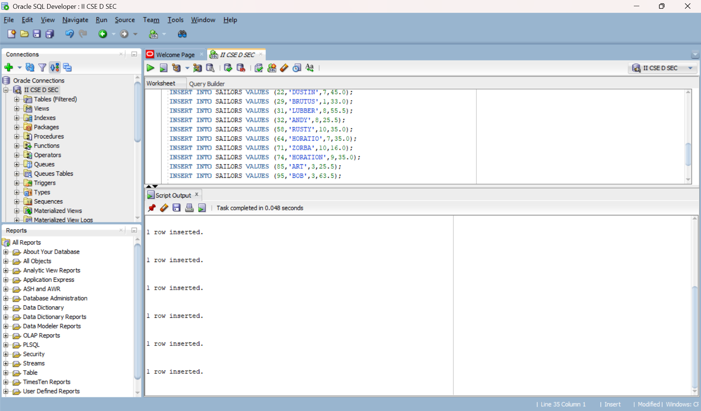
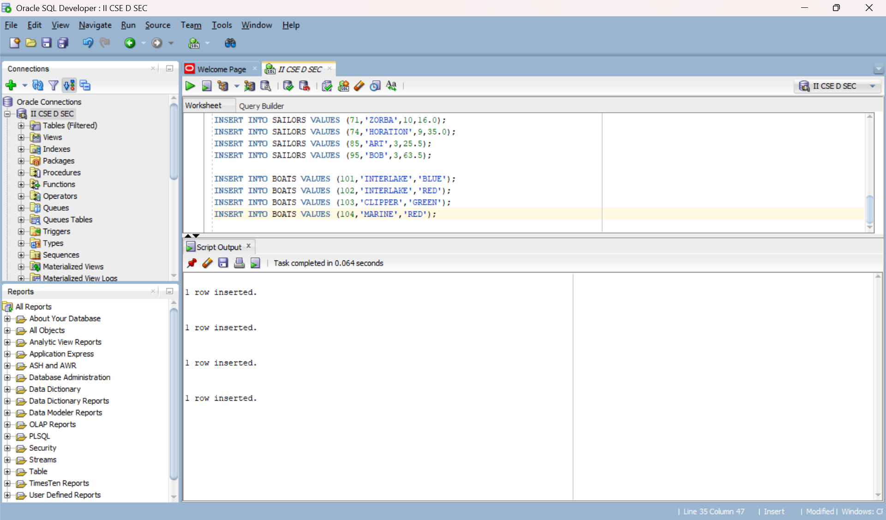
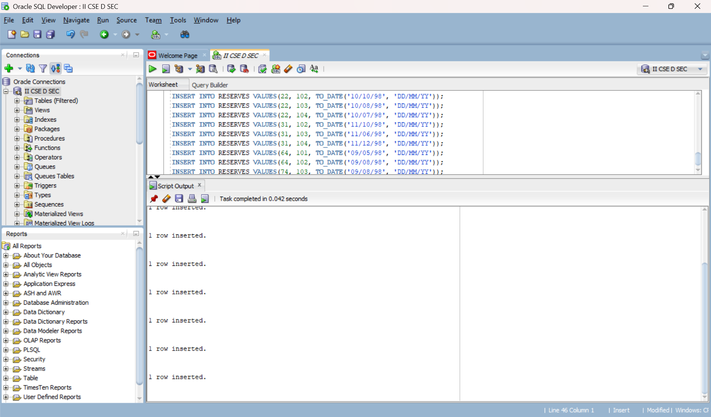

#(2) 2.Find the names and ages of all sailors.

```
SELECT DISTINCT SNAME, AGE
FROM SAILORS;

```
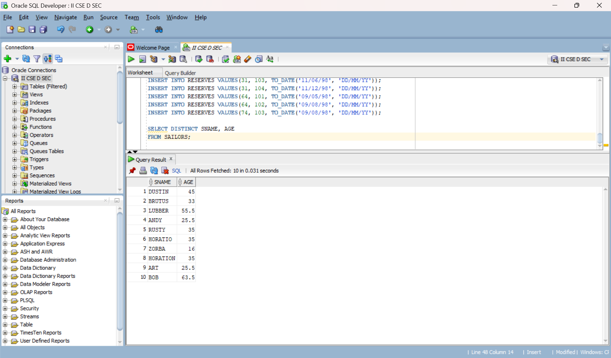

#(2) 3.Find all sailors with a rating above 7.

```
SELECT * FROM SAILORS
WHERE RATING > 7;

```
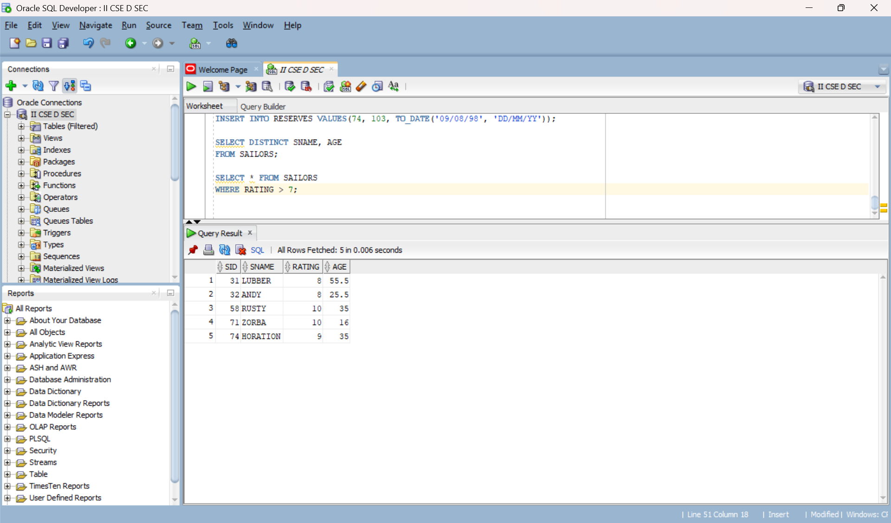

#(2) 4.Find the names of sailors who have reserved boat number 103

```
SELECT S.SNAME
FROM SAILORS S, RESERVES R
WHERE S.SID = R.SID
AND R.BID = 103;

```


#(2) 5.Find the sids of sailors who have reserved a red boat.

```
SELECT S.SID
FROM SAILORS S, RESERVES R, BOATS B
WHERE S.SID = R.SID
AND R.BID = B.BID
AND B.COLOR = 'RED';

```
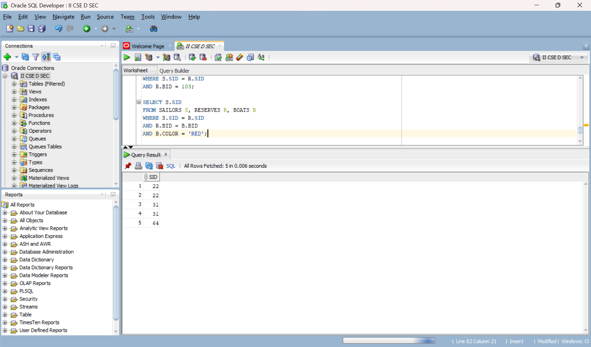

#(2) 6.Find the names of sailors who have reserved a red boat.

```
SELECT S.SNAME
FROM SAILORS S, RESERVES R, BOATS B
WHERE S.SID = R.SID
AND R.BID = B.BID
AND B.COLOR = 'RED';

```
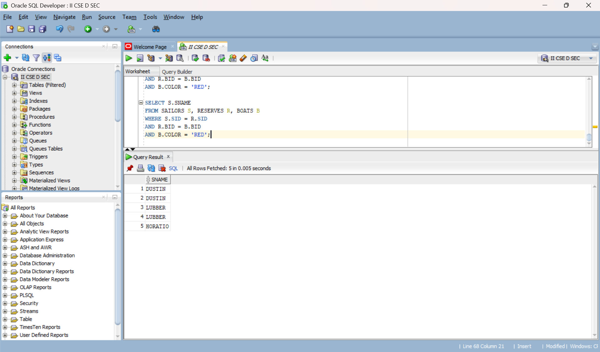

#(2) 7.Find the colors of boats reserved by Lubber.

```
SELECT B.COLOR
FROM SAILORS S, RESERVES R, BOATS B
WHERE S.SID = R.SID
AND R.BID = B.BID
AND S.SNAME = 'LUBBER';

```
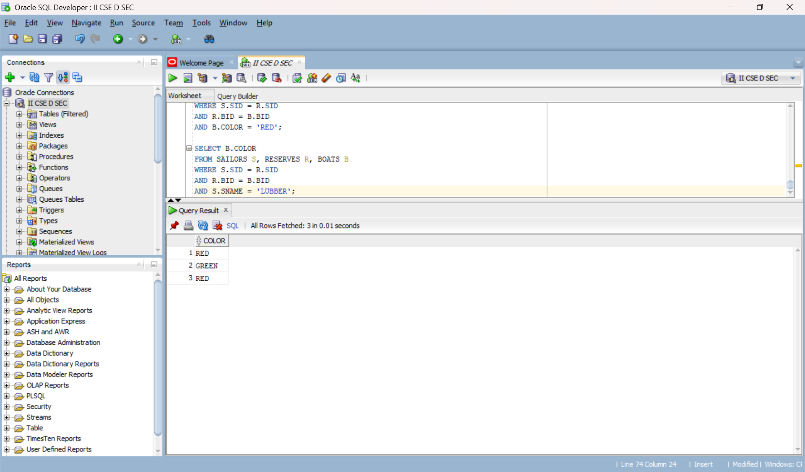

#(2) 8.Find the names of sailors who have reserved at least one boat.

```
SELECT DISTINCT S.SNAME 
FROM SAILORS S , RESERVES R
WHERE S.SID = R.SID;

```
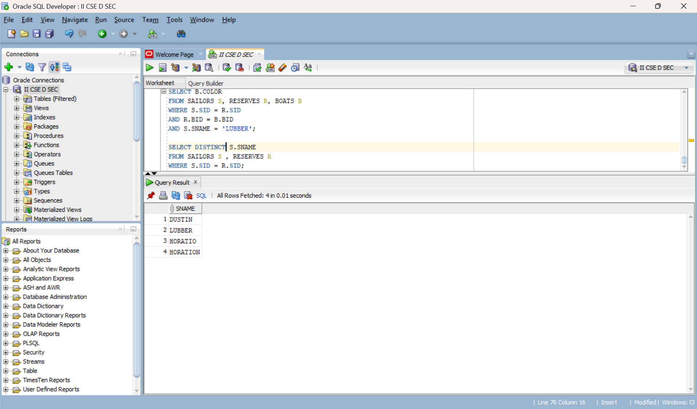

#(2) 9.Compute increments for the ratings of persons who have sailed two different boats on the same day.

```
UPDATE Sailors
SET RATING = RATING + 1
WHERE SID IN
(
    SELECT R1.SID
    FROM Reserves R1, Reserves R2
    WHERE R1.SID = R2.SID
      AND R1.DAY = R2.DAY
      AND R1.BID <> R2.BID
);

```
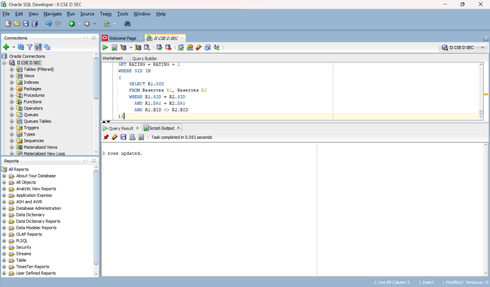

#(2) 10.Find the ages of sailors whose name begins and ends with B and has at least three characters.

```
SELECT AGE
FROM Sailors
WHERE SNAME LIKE 'B%B'
  AND LENGTH(SNAME) >= 3;

```
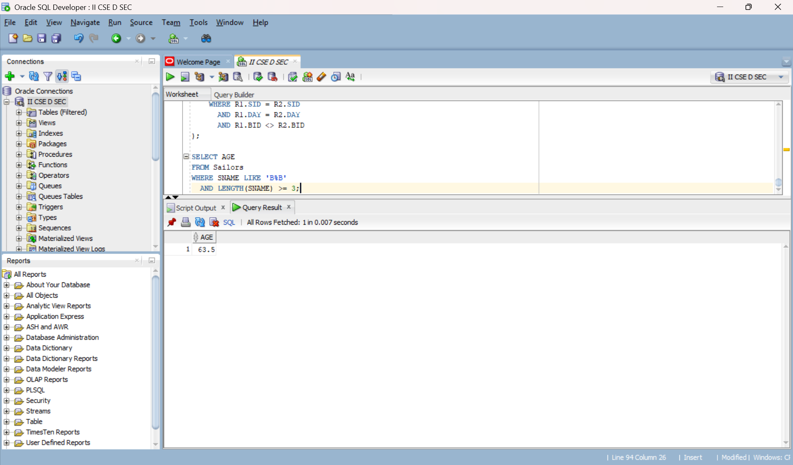

#(2) 11.Find the names of Sailors who reserved a red boat or a green boat.

```
SELECT DISTINCT S.SNAME
FROM Sailors S, Reserves R, Boats B
WHERE S.SID = R.SID
  AND R.BID = R.BID
  AND B.COLOR IN ('red')
UNION
SELECT DISTINCT S.SNAME
FROM Sailors S, Reserves R, Boats B
WHERE S.SID = R.SID
  AND R.BID = B.BID
  AND B.COLOR IN ('green');

```
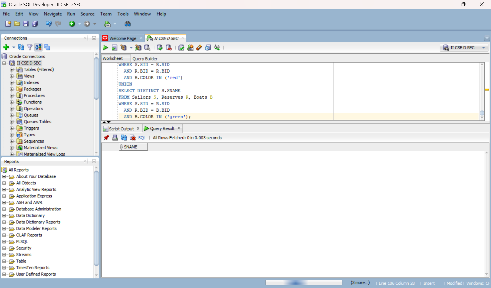

#(2) 12.Find the names of sailors who have reserved both a red and a green boat.

```
SELECT DISTINCT S.SNAME
FROM Sailors S, Reserves R, Boats B
WHERE S.SID = R.SID
  AND R.BID = B.BID
  AND B.COLOR = 'red'
INTERSECT
SELECT DISTINCT S.SNAME
FROM Sailors S, Reserves R, Boats B
WHERE S.SID = R.SID
  AND R.BID = B.BID
  AND B.COLOR = 'green';

```
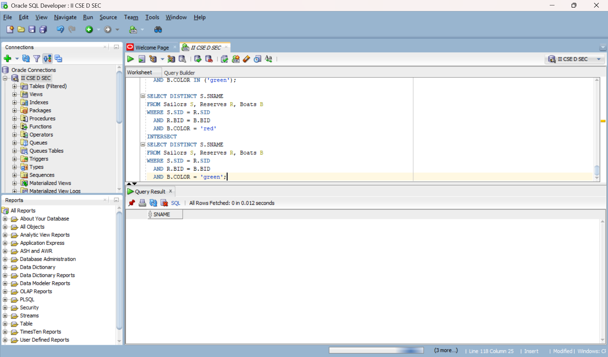

#(2) 13.Find the sids of all sailors who have reserved red boats but not green boats.

```
SELECT DISTINCT R.SID
FROM Reserves R, Boats B
WHERE R.BID = B.BID
  AND B.COLOR = 'red'
MINUS
SELECT DISTINCT R.SID
FROM Reserves R, Boats B
WHERE R.BID = B.BID
  AND B.COLOR = 'green';

```
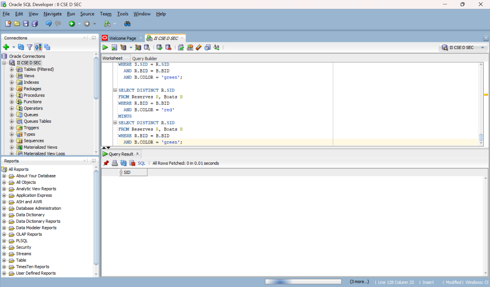

#(2) 14.Find all sids of sailors who have a rating of 10 or have reserved boat 104

```
SELECT SID
FROM Sailors
WHERE RATING = 10
UNION
SELECT SID
FROM Reserves
WHERE BID = 104;

```
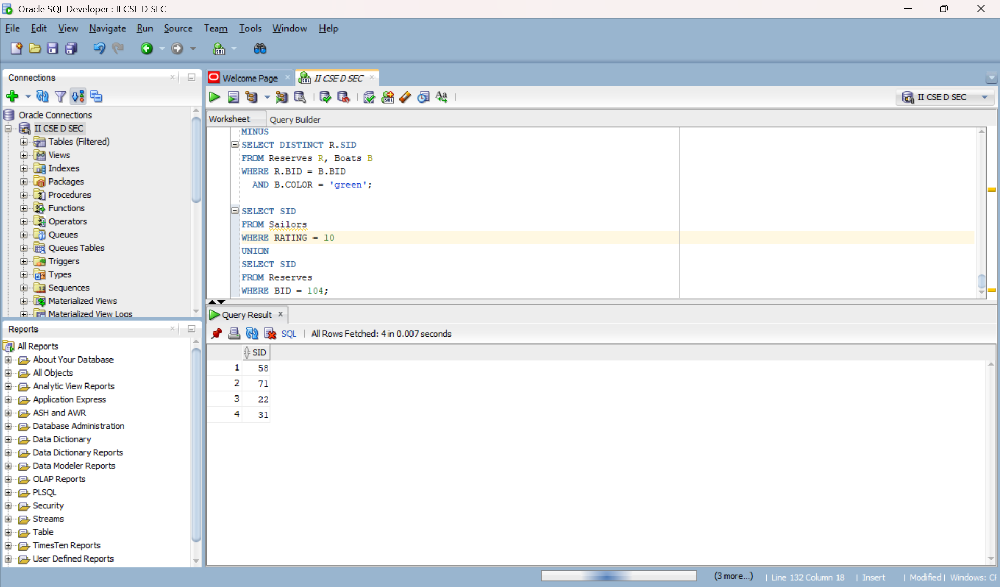

#(2) 15.Find the names of sailors who have reserved boat 103

```
SELECT S.SNAME
FROM Sailors S
WHERE S.SID IN
(
  SELECT SID
  FROM RESERVES
  WHERE BID = 103
 );

```
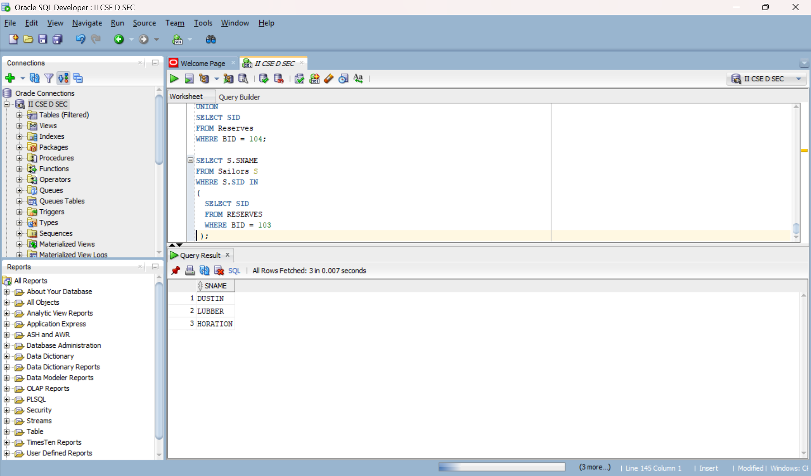

#(2) 16.Find the names of sailors who have reserved a red boat

```
SELECT S.SNAME
FROM Sailors S
WHERE S.SID IN
(
    SELECT R.SID
    FROM Reserves R
    WHERE R.BID IN
    (
        SELECT B.BID
        FROM Boats B
        WHERE B.COLOR = 'red'
    )
);

```
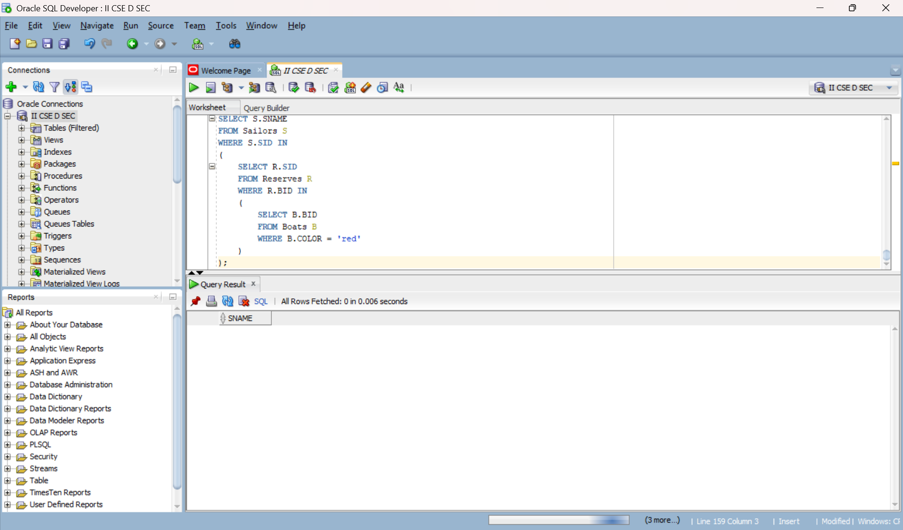

#(2) 17.Find the names of sailors who have reserved boat number 103

```
SELECT S.SNAME
FROM Sailors S
WHERE S.SID IN
(
    SELECT SID
    FROM Reserves
    WHERE BID = 103
);

```
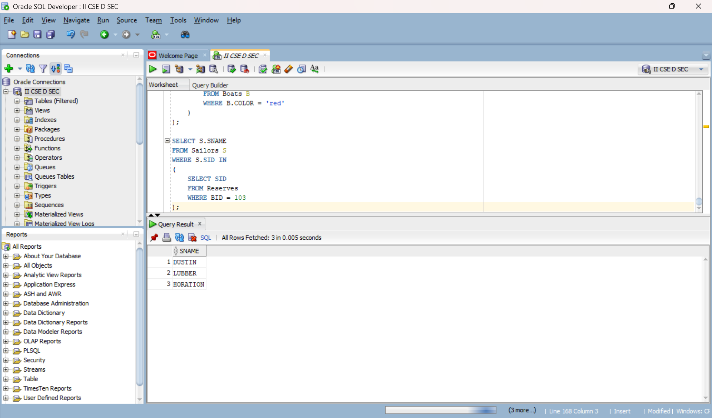

#(2) 18.Find sailors whose rating is better than some sailor called Horatio.

```
SELECT * FROM Sailors
WHERE RATING > ANY
(
    SELECT RATING
    FROM Sailors
    WHERE SNAME = 'Horatio'
);

```
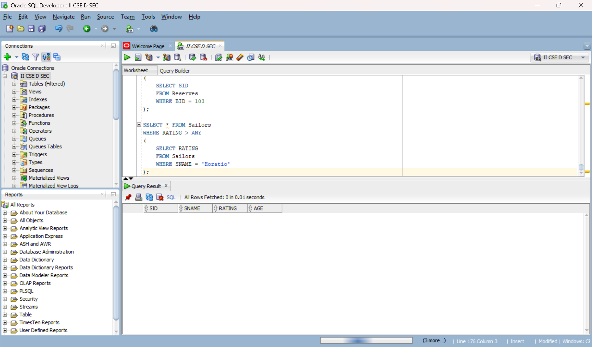

#(2) 19.Find sailors whose rating is better than every sailor called Horatio.

```
SELECT * FROM Sailors
WHERE RATING > ALL
(
    SELECT RATING
    FROM Sailors
    WHERE SNAME = 'Horatio'
);

```
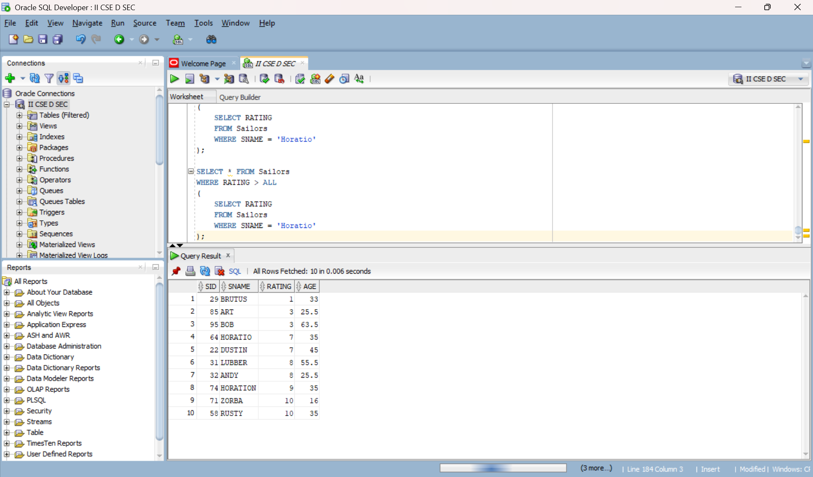

#(2) 20.Find the sailors with the highest rating.

```
SELECT * FROM Sailors
WHERE RATING = 
(
    SELECT MAX(RATING)
    FROM Sailors
);

```
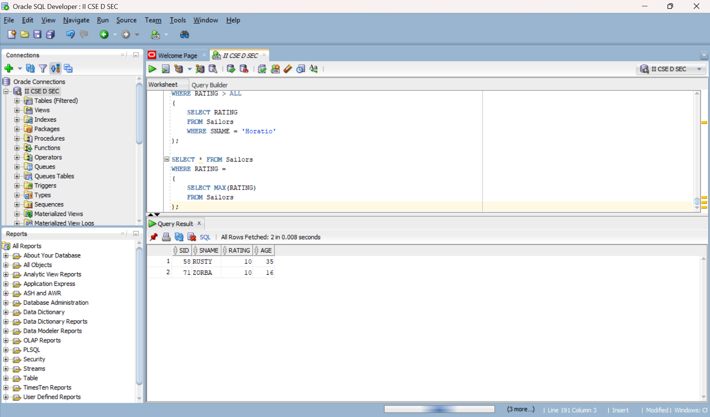

#(2) 21.Find the names of sailors who have reserved both a red and a green boat.

```
SELECT DISTINCT S.SNAME
FROM SAILORS S
WHERE S.SID IN
(
    SELECT R.SID
    FROM RESERVES R
    WHERE R.BID IN
    (
        SELECT B.BID
        FROM BOATS B
        WHERE B.COLOR = 'RED'
    )
)
AND S.SID IN
(
 SELECT R.SID
    FROM RESERVES R
    WHERE R.BID IN
    (
        SELECT B.BID
        FROM BOATS B
        WHERE B.COLOR = 'GREEN'
    )
);

```
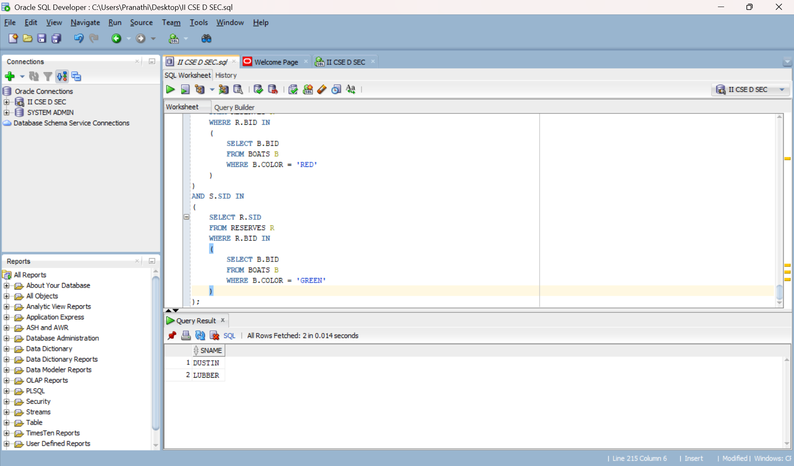

#(2) 22.Find the names of sailors who have reserved all boats.

```
SELECT S.SNAME
FROM SAILORS S, RESERVES R
WHERE S.SID = R.SID
GROUP BY S.SNAME
HAVING COUNT(DISTINCT R.BID) = (SELECT COUNT(*) FROM BOATS);

```
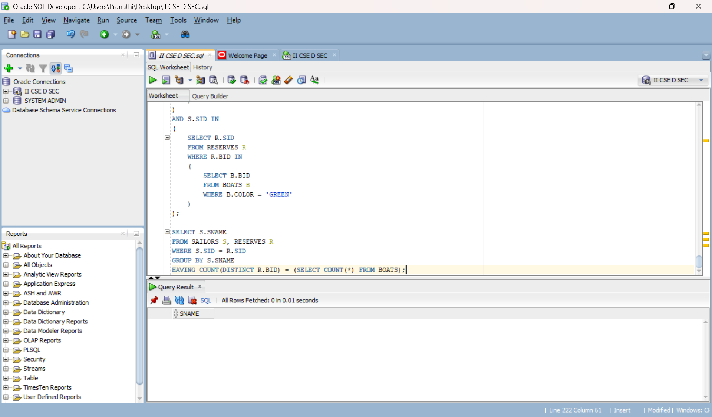

#(2) 23.Find the average age of all sailors.

```
SELECT AVG(AGE)
FROM Sailors;

```
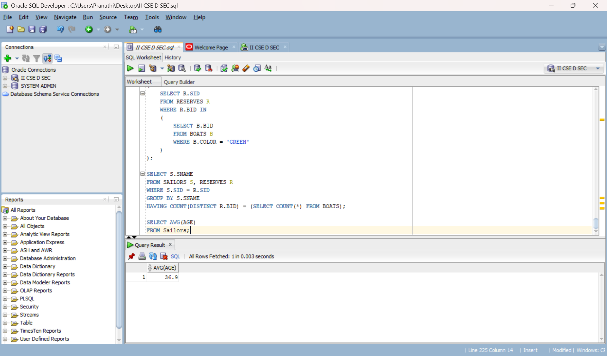

#(2) 24.Find the average age of sailors with a rating of 10.

```
SELECT AVG(AGE)
FROM SAILORS 
WHERE RATING = 10;

```
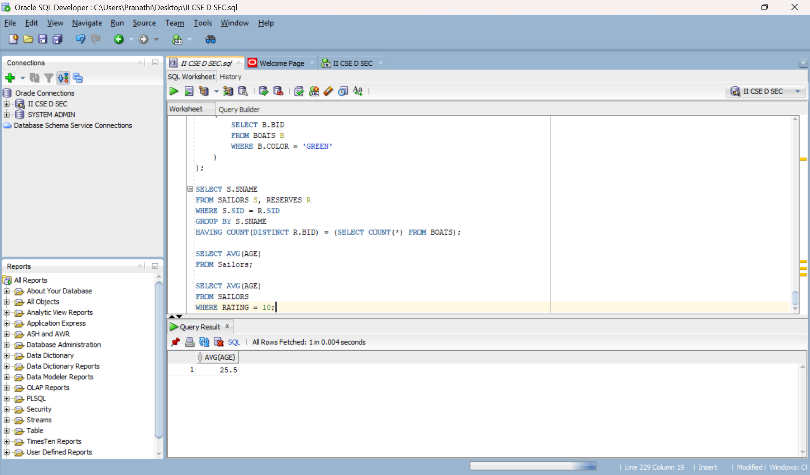

#(2) 25.Find the name and age of the oldest sailor.

```
SELECT SNAME, AGE
FROM Sailors
WHERE AGE =
(
    SELECT MAX(AGE)
    FROM Sailors
);

```
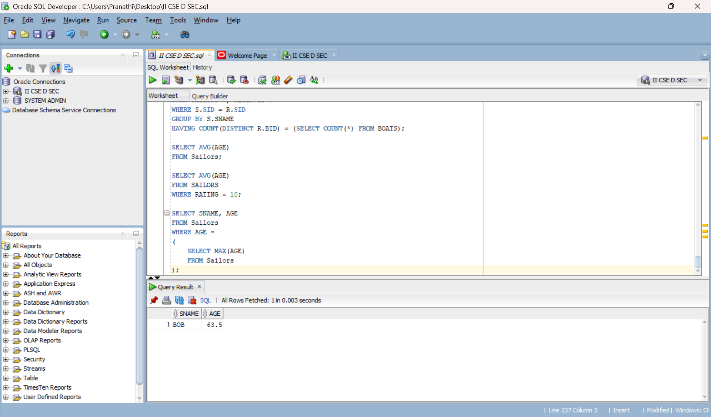

#(2) 26.Count the number of sailors.

```
SELECT COUNT (*) FROM Sailors;

```


#(2) 27.Count the number of different sailor names.

```
SELECT COUNT (DISTINCT SNAME) 
FROM SAILORS;

```
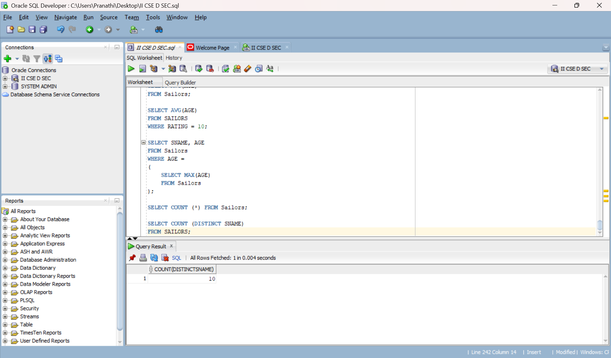

#(2) 28.Find the names of sailors who are older than the oldest sailor with a rating of 10.

```
SELECT SNAME
FROM Sailors 
WHERE AGE >
(
    SELECT MAX(AGE)
    FROM Sailors 
    WHERE RATING = 10
);

```
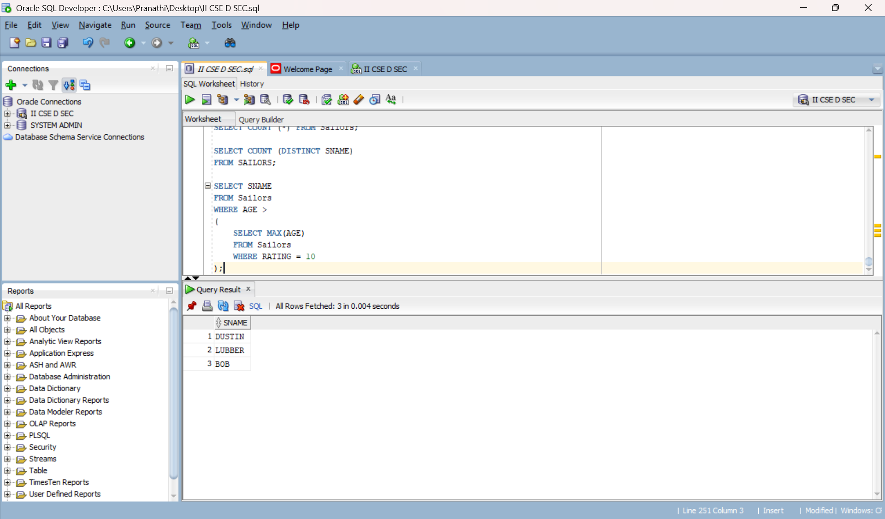

#(2) 29.Find the age of the youngest sailor for each rating level.

```
SELECT RATING,MIN (AGE)
FROM SAILORS
GROUP BY RATING;

```
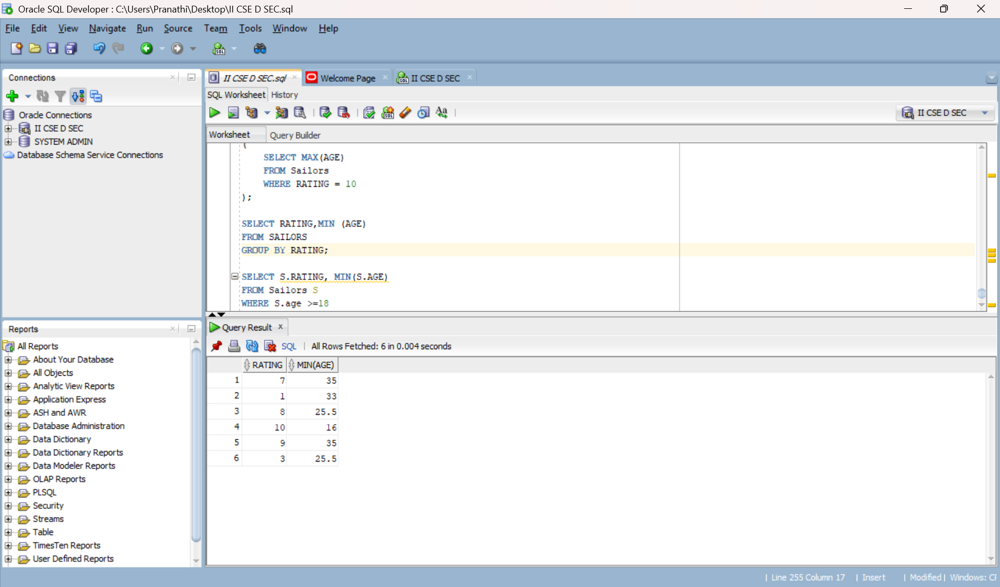

#(2) 30.Find the age of the youngest sailor who is eligible to vote (i.e., is at least 18 years old) for each rating level with at least two such sailors.

```
SELECT S.RATING, MIN(S.AGE)
FROM Sailors S
WHERE S.age >=18
GROUP BY S.RATING
HAVING COUNT (*) >1;

```
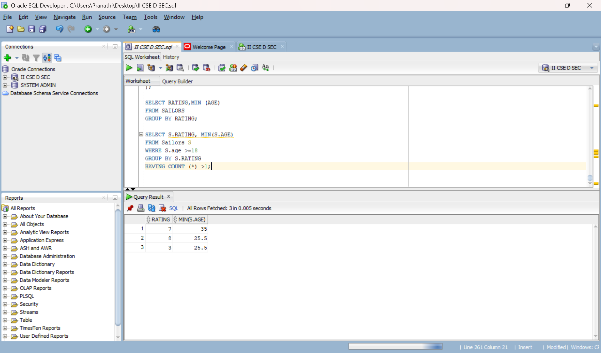

#(2) 31.For each red boat, find the number of reservations for this boat.

```
SELECT B.BID, COUNT(*) AS RESERVATION_COUNT
FROM Boats B, Reserves R
WHERE R.BID = B.BID
  AND B.COLOR = 'red'
GROUP BY B.BID;

```
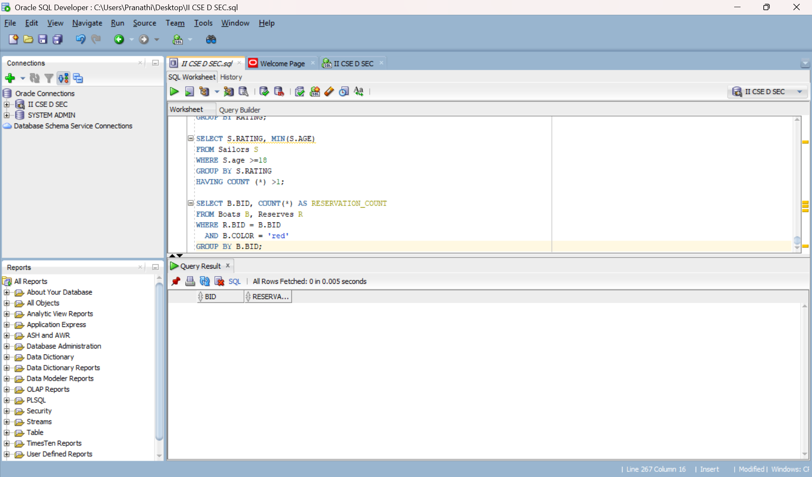

#(2) 32.Find the average age of sailors for each rating level that has at least two sailors.

```
SELECT S.RATING, AVG(S.AGE) 
FROM Sailors S
GROUP BY S.RATING
HAVING COUNT(*) >1;


```


#(2) 33.Find the average age of sailors who are of voting age (i.e., at least 18 years old) for each rating level that has at least two sailors.

```
SELECT S.RATING, AVG(S.AGE) 
FROM Sailors S
WHERE S.AGE >= 18
GROUP BY S.RATING
HAVING COUNT(*) >1;

```
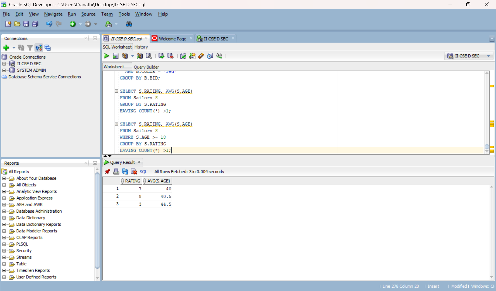

#(2) 34.Find the average age of sailors who are of voting age (i.e., at least 18 years old) for each rating level that has at least two such sailors.

```
SELECT RATING, AVG(AGE) AS AVERAGE_AGE
FROM Sailors S
WHERE S.AGE >= 18
GROUP BY S.RATING
HAVING COUNT(*) >1;

```
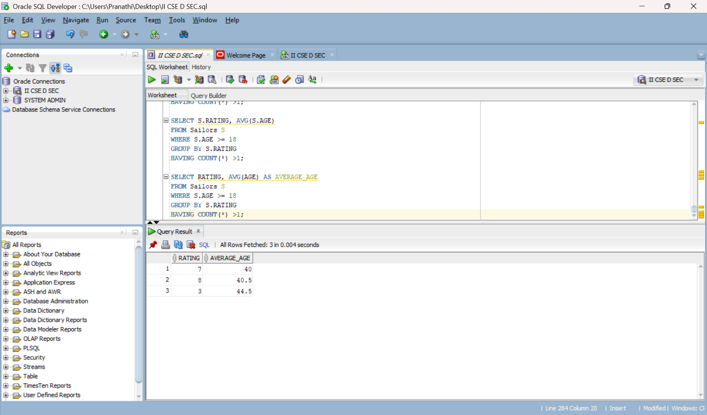

#(2) 35.Find those ratings for which the average age of sailors is the minimum over all ratings.

```
SELECT S.RATING
FROM SAILORS S
GROUP BY S.RATING
HAVING AVG(S.AGE) <=ALL
(
 SELECT AVG(S2.AGE)
 FROM SAILORS S2
 GROUP BY S2.RATING
 );

```
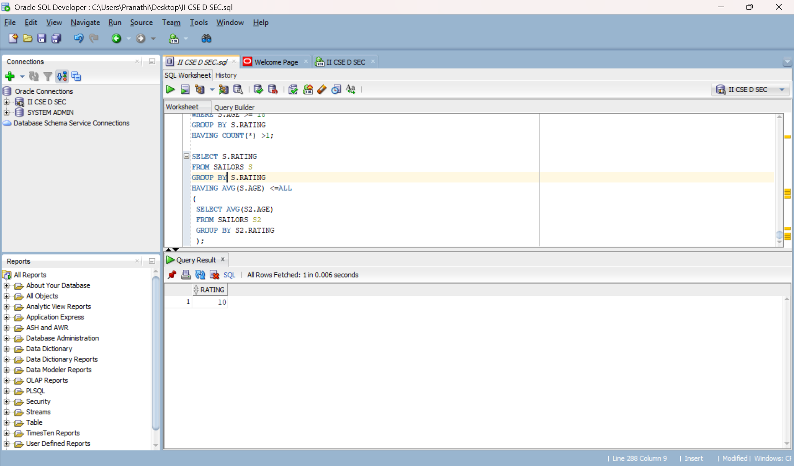
