# (3a) 1.To create table employee

```
CREATE TABLE employee (
    employee_id NUMBER(5) PRIMARY KEY,
    first_name VARCHAR2(20),
    last_name VARCHAR2(20),
    gender CHAR(1),
    job_id VARCHAR2(15),
    department VARCHAR2(30),
    salary NUMBER(8,2),
    commission NUMBER(5,2),
    hire_date DATE,
    city VARCHAR2(20)
);

```
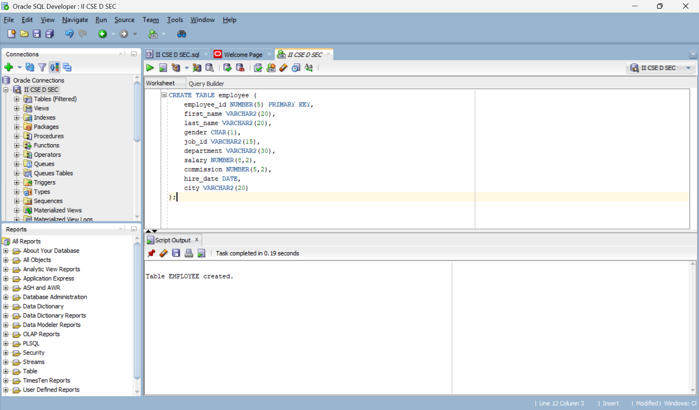

# (3a) 2.Insert employee values

```
INSERT INTO employee VALUES
(101, 'John', 'Smith', 'M', 'IT_PROG', 'IT', 6500, 5,
TO_DATE('15-JAN-2020','DD-MON-YYYY'), 'Hyderabad');
INSERT INTO employee VALUES
(102, 'Anita', 'Sharma', 'F', 'HR_REP', 'HR', 5200, 3,
TO_DATE('10-JUN-2019','DD-MON-YYYY'), 'Bengaluru');
INSERT INTO employee VALUES
(103, 'Rahul', 'Kumar', 'M', 'SA_REP', 'Sales', 4800, 8,
TO_DATE('25-AUG-2021','DD-MON-YYYY'), 'Chennai');
INSERT INTO employee VALUES
(104, 'Priya', 'Reddy', 'F', 'MK_MAN', 'Marketing', 7200, 10,
TO_DATE('05-MAR-2018','DD-MON-YYYY'), 'Hyderabad');
INSERT INTO employee VALUES
(105, 'David', 'Wilson', 'M', 'FI_ACCOUNT', 'Finance', 5800, NULL,
TO_DATE('18-DEC-2017','DD-MON-YYYY'), 'Mumbai');
INSERT INTO employee VALUES
(106, 'Sneha', 'Patel', 'F', 'IT_PROG', 'IT', 6900, 6,
TO_DATE('12-NOV-2022','DD-MON-YYYY'), 'Pune');
INSERT INTO employee VALUES
(107, 'Amit', 'Verma', 'M', 'SA_REP', 'Sales', 4500, 4,
TO_DATE('20-JUL-2023','DD-MON-YYYY'), 'Delhi');
INSERT INTO employee VALUES
(108, 'Kiran', 'Rao', 'M', 'HR_REP', 'HR', 5000, NULL,
TO_DATE('09-FEB-2021','DD-MON-YYYY'), 'Hyderabad');
INSERT INTO employee VALUES
(109, 'Lakshmi', 'Nair', 'F', 'IT_PROG', 'IT', 7600, 7,
TO_DATE('14-SEP-2016','DD-MON-YYYY'), 'Kochi');
INSERT INTO employee VALUES
(110, 'Arjun', 'Singh', 'M', 'MK_MAN', 'Marketing', 6800, 5,
TO_DATE('30-APR-2019','DD-MON-YYYY'), 'Jaipur');
COMMIT;

```
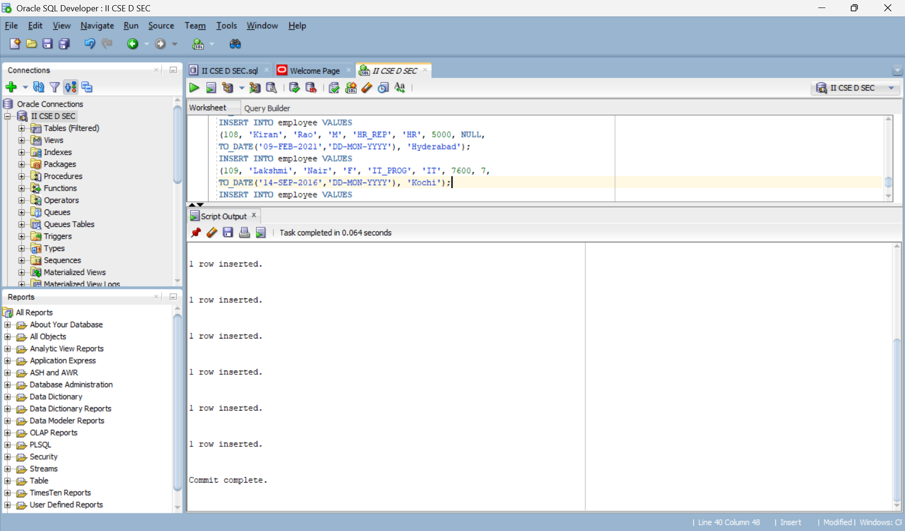

#(3a) 3.Write an SQL query to display the employee ID, first name, and hire date in the format DD-MON-YYYY using the TO_CHAR function.

```
SELECT employee_id, first_name,
TO_CHAR(hire_date, 'DD-MON-YYYY') AS hire_date
FROM employee;

```
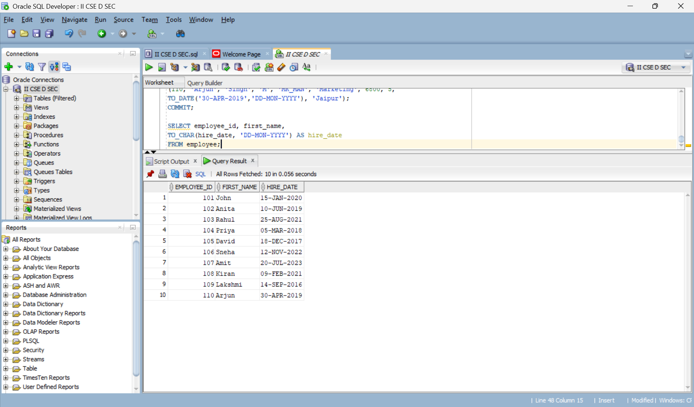

#(3a) 4.Write an SQL query to display the employee ID, first name, and salary formatted with a currency symbol using the TO_CHAR function.

```
SELECT employee_id, first_name,
TO_CHAR(salary, 'L99,999.00') AS salary
FROM employee;

```
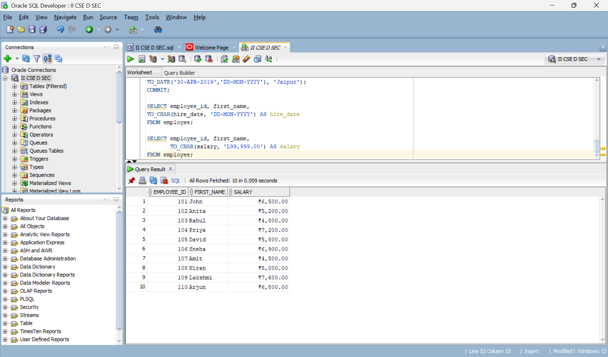

#(3a) 5.Write an SQL query to add 5000 to each employee's salary using the TO_NUMBER function.

```
SELECT employee_id, first_name, salary,
TO_NUMBER(TO_CHAR(salary)) + 5000 AS new_salary
FROM employee;

```
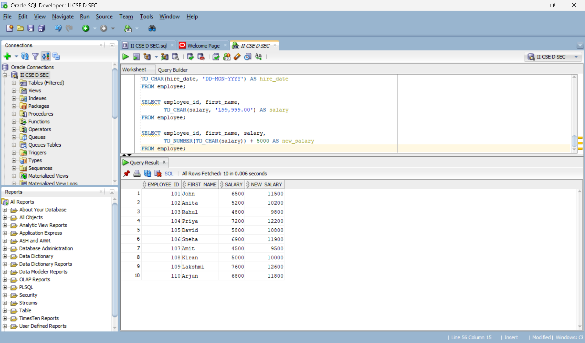

#(3a) 6.Write an SQL query to display the details of employees who were hired after 01-JAN-2020 using the TO_DATE function.

```
SELECT * FROM employee
WHERE hire_date > TO_DATE('01-JAN-2020', 'DD-MON-YYYY');

```
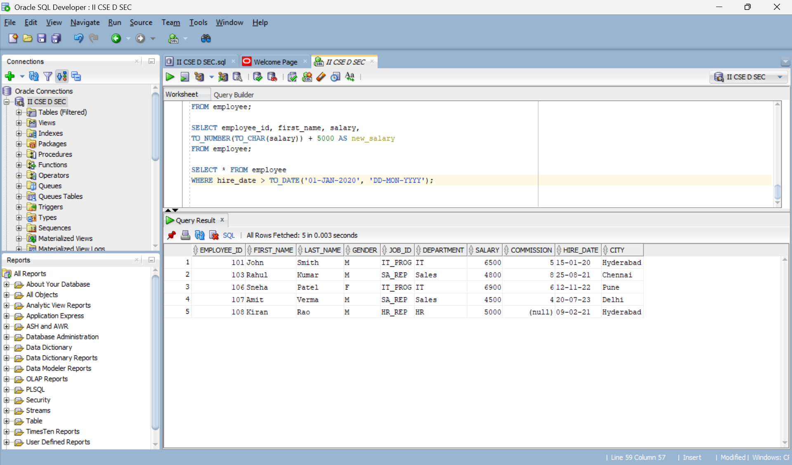

#(3a) 7.Write an SQL query to display the full name of each employee by concatenating the first name and last name using the concatenation (||) operator.

```
SELECT employee_id,
first_name || ' ' || last_name AS full_name
FROM employee;

```


#(3a) 8.Write an SQL query to concatenate the first name and last name of each employee using the CONCAT function.

```
SELECT employee_id,
CONCAT(CONCAT(first_name, ' '), last_name) AS full_name
FROM employee;

```
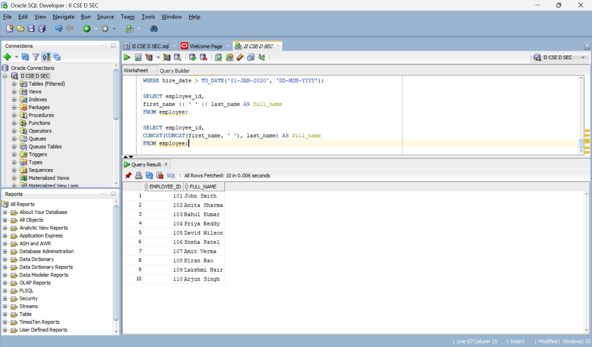

#(3a) 9.Write an SQL query to display each employee's first name left-padded with * characters using the LPAD function.

```
SELECT employee_id,
LPAD(first_name, 10, '*') AS padded_name
FROM employee;

```
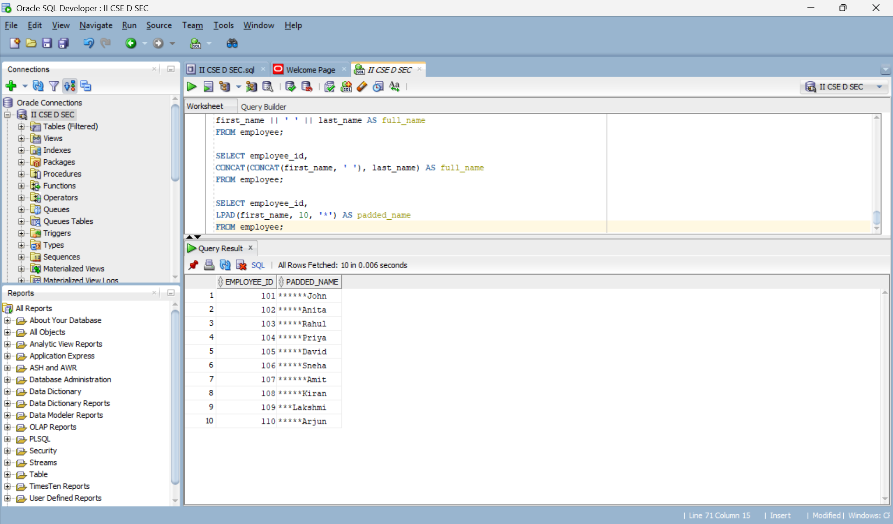

#(3a) 10.Write an SQL query to display each employee's first name right-padded with * characters using the RPAD function.

```
SELECT employee_id,
RPAD(first_name, 10, '*') AS padded_name
FROM employee;

```


#(3a) 11.Write an SQL query to remove leading spaces from employee names using the LTRIM function.

```
SELECT employee_id, first_name,
LTRIM(first_name) AS trimmed_name
FROM employee;

```
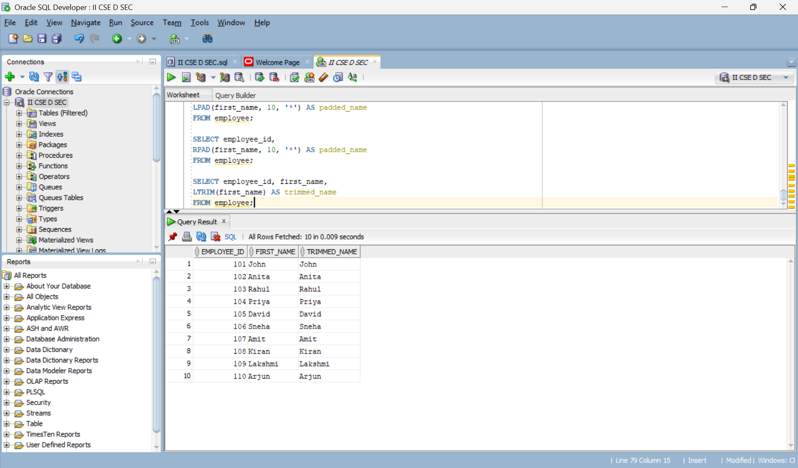

#(3a) 12.Write an SQL query to remove trailing spaces from employee names using the RTRIM function.

```
SELECT employee_id, first_name,
RTRIM(first_name) AS trimmed_name
FROM employee;

```
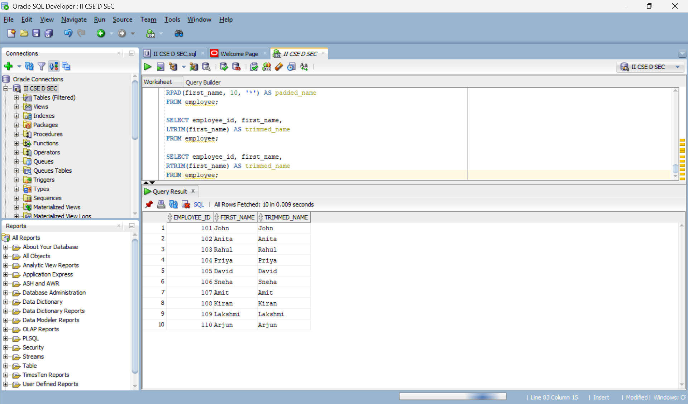

#(3a) 13.Write an SQL query to display all employee first names in lowercase using the LOWER function.

```
SELECT employee_id,
LOWER(first_name) AS first_name
FROM employee;

```
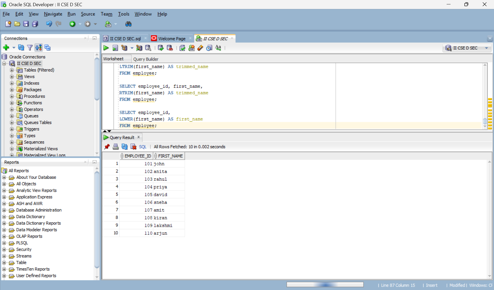

#(3a) 14.Write an SQL query to display all employee first names in uppercase using the UPPER function.

```
SELECT employee_id,
UPPER(first_name) AS first_name
FROM employee;

```
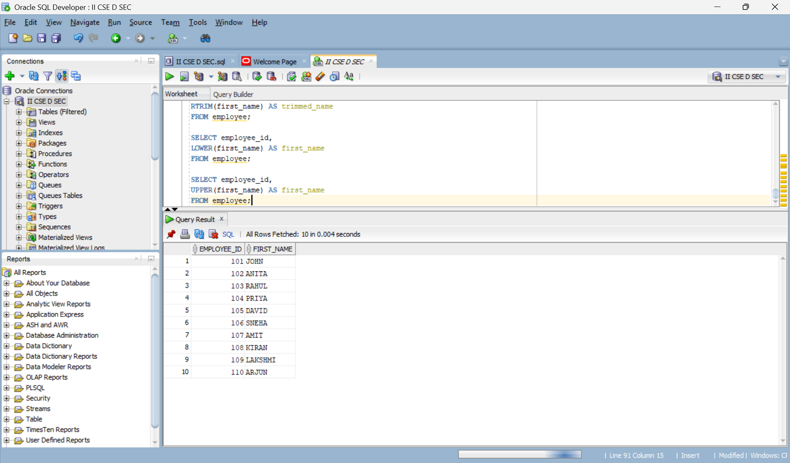

#(3a) 15.Write an SQL query to display employee first names in proper case using the INITCAP function.

```
SELECT employee_id,
INITCAP(first_name) AS first_name
FROM employee;

```
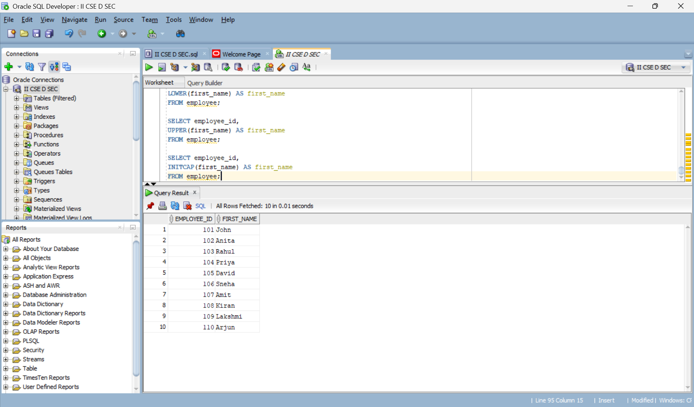

#(3a) 16.Write an SQL query to display the length of each employee's first name using the LENGTH function.

```
SELECT employee_id,first_name,
LENGTH(first_name) AS name_length
FROM employee;

```
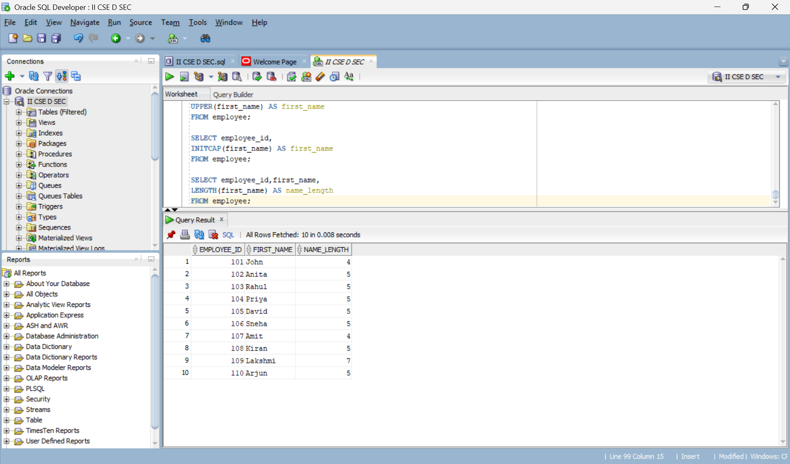

#(3a) 17.Write an SQL query to display the first three characters of each employee's first name using the SUBSTR function.

```
SELECT employee_id, first_name,
SUBSTR(first_name, 1, 3) AS first_three
FROM employee;

```
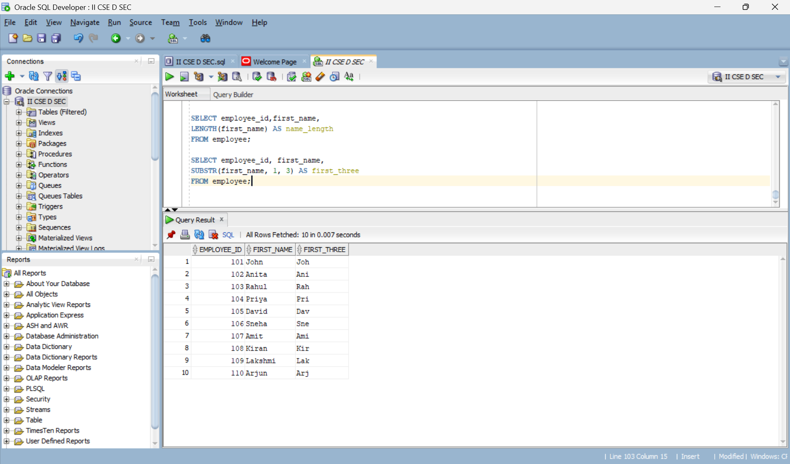

#(3a) 18.Write an SQL query to find the position of the character 'a' in each employee's first name using the INSTR function.

```
SELECT employee_id, first_name,
INSTR(first_name, 'a') AS position
FROM employee;

```
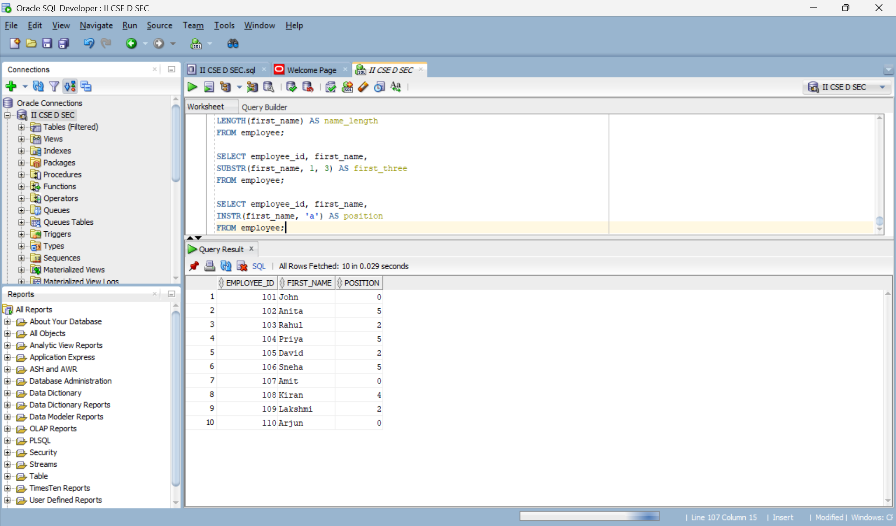

#(3a) 19.Write an SQL query to display the current system date along with each employee's details using the SYSDATE function.

```
SELECT employee_id, first_name, last_name, department, salary, hire_date,
SYSDATE AS current_date
FROM employee;

```
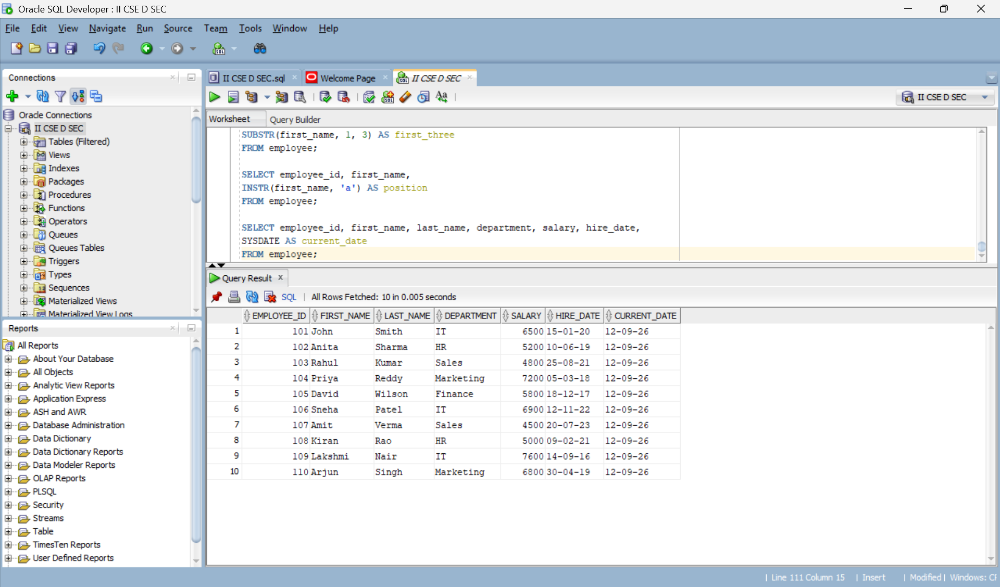

#(3a) 20.Write an SQL query to display the next Monday after each employee's hire date using the NEXT_DAY function.

```
SELECT employee_id, first_name, hire_date,
NEXT_DAY(hire_date, 'MONDAY') AS next_monday
FROM employee;

```
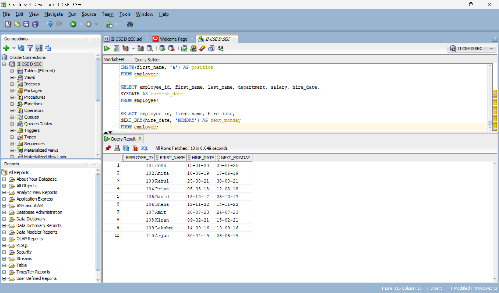

#(3a) 21.Write an SQL query to display the date obtained by adding six months to each employee's hire date using the ADD_MONTHS function.

```
SELECT employee_id, first_name, hire_date,
ADD_MONTHS(hire_date, 6) AS new_hire_date
FROM employee;

```
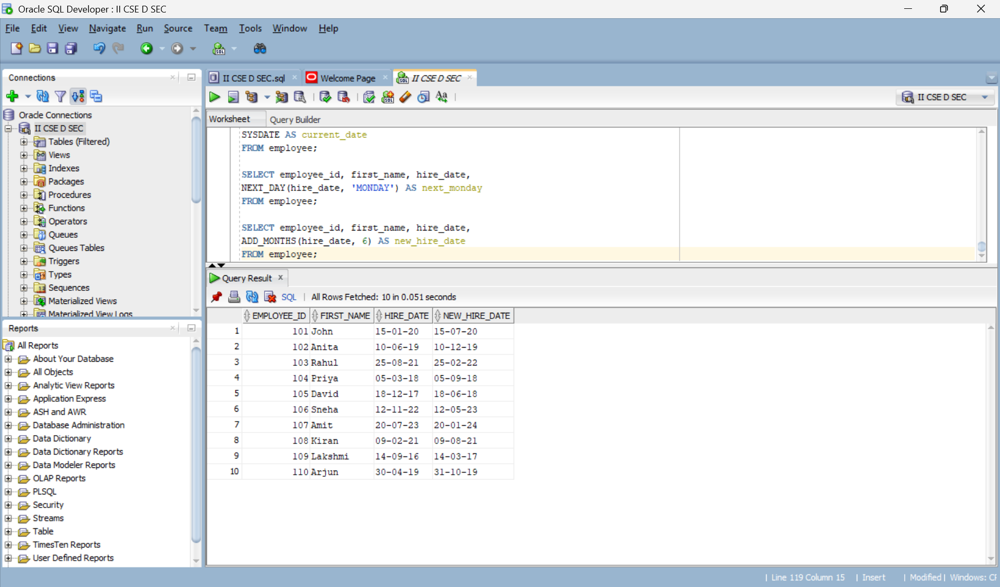

#(3a) 22.Write an SQL query to display the last day of the month for each employee's hire date using the LAST_DAY function.

```
SELECT employee_id, first_name, 
LAST_DAY(hire_date) AS last_day
FROM employee;

```
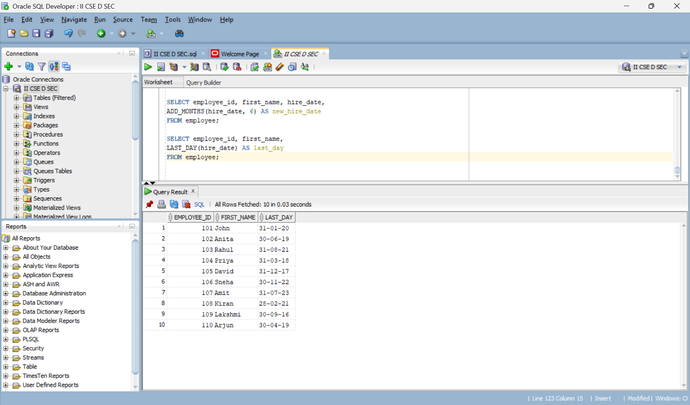

#(3a) 23.Write an SQL query to calculate the total number of months each employee has worked using the MONTHS_BETWEEN function.

```
SELECT employee_id, first_name, 
MONTHS_BETWEEN(SYSDATE, hire_date) AS months_worked
FROM employee;

```
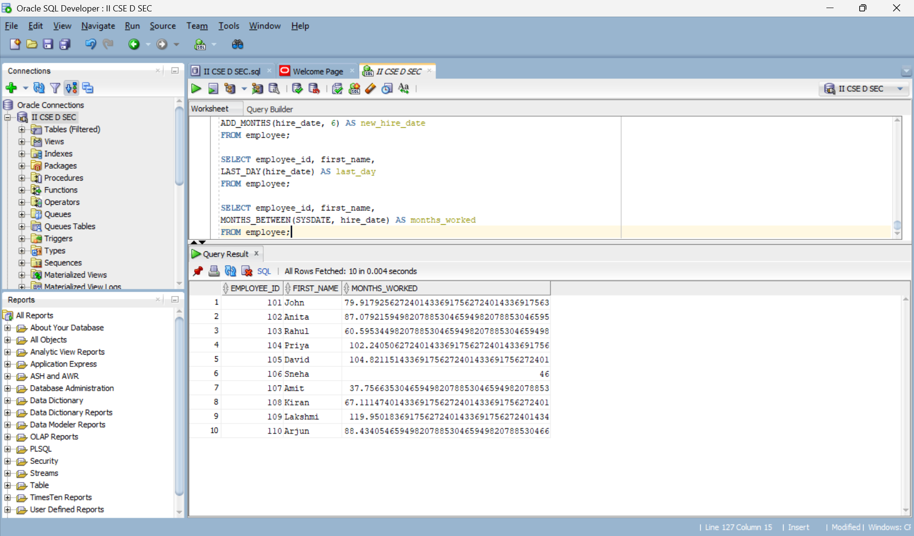

#(3a) 24.Write an SQL query to display the smaller value between each employee's salary and 60000 using the LEAST function.

```
SELECT employee_id, first_name, 
LEAST(salary, 60000) AS smaller_value
FROM employee;

```
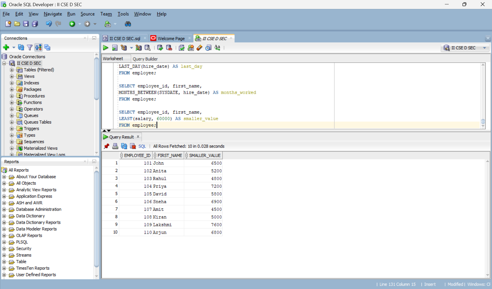

#(3a) 25.Write an SQL query to display the greater value between each employee's salary and 60000 using the GREATEST function.

```
SELECT employee_id, salary, GREATEST(salary, 60000) AS greater_value
FROM employee;

```
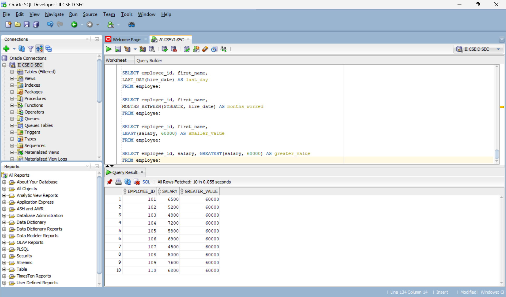

#(3a) 26.Write an SQL query to display the first day of the month of each employee's hire date using the TRUNC function.

```
SELECT employee_id, hire_date, TRUNC(hire_date, 'MM') AS first_day_of_month
FROM employee;

```
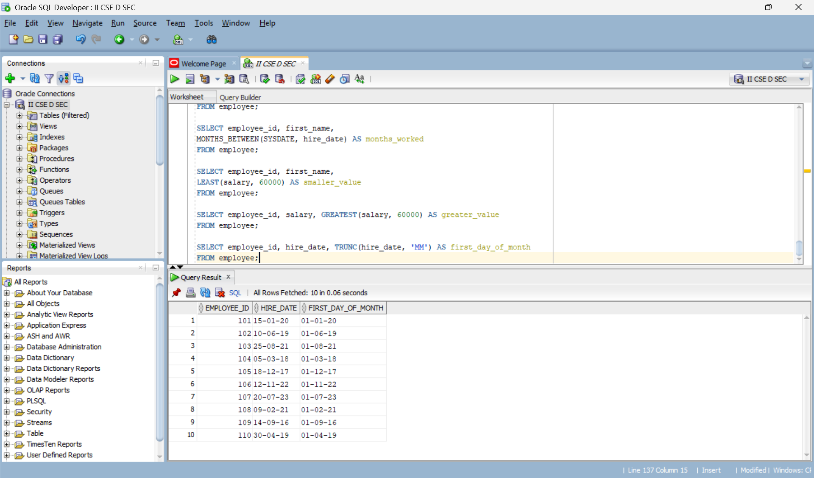

#(3a) 27.Write an SQL query to round each employee's hire date to the nearest month using the ROUND function.

```
SELECT employee_id, hire_date, ROUND(hire_date, 'MM') AS rounded_hire_date
FROM employee;

```
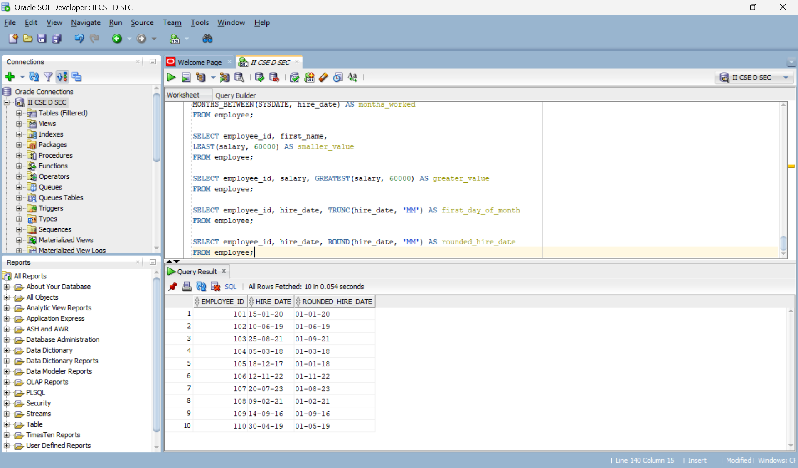

#(3a) 28.Write an SQL query to display each employee's hire date in the format DAY, DD-MON-YYYY using the TO_CHAR function.

```
SELECT employee_id, TO_CHAR(hire_date, 'DAY, DD-MON-YYYY') AS hire_date
FROM employee;

```
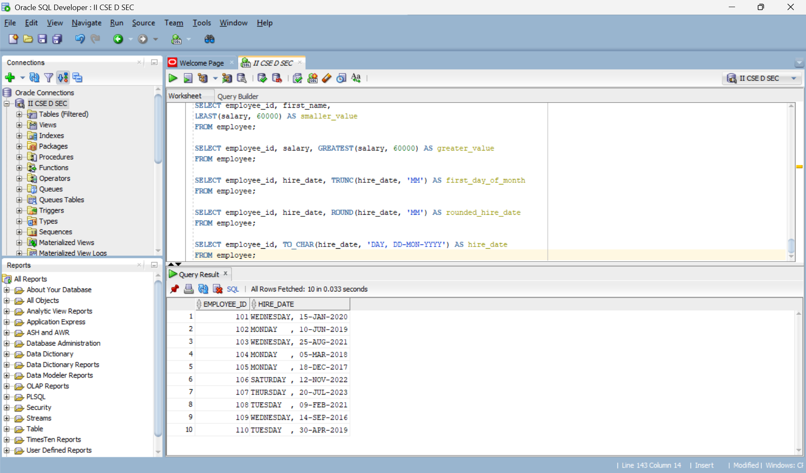

#(3a) 29.Write an SQL query to display the details of employees who were hired before 01-JAN-2019 using the TO_DATE function.

```
SELECT * FROM employee
WHERE hire_date < TO_DATE('01-JAN-2019', 'DD-MON-YYYY');

```
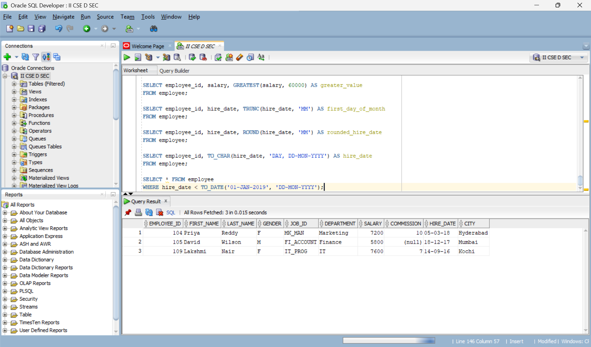
