#(4) 1. Create a dept table having dno, dname as columns.

```
CREATE TABLE dept (
    dno NUMBER,
    dname VARCHAR2(20)
);

```
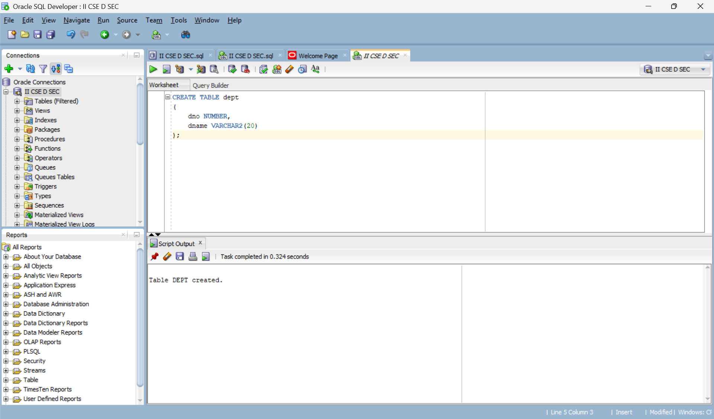

#(4) 2. Apply appropriate constraints on dept table.

```
ALTER TABLE dept
ADD CONSTRAINT dept_pk PRIMARY KEY (dno);

ALTER TABLE dept
MODIFY dname VARCHAR2(20) NOT NULL;

```
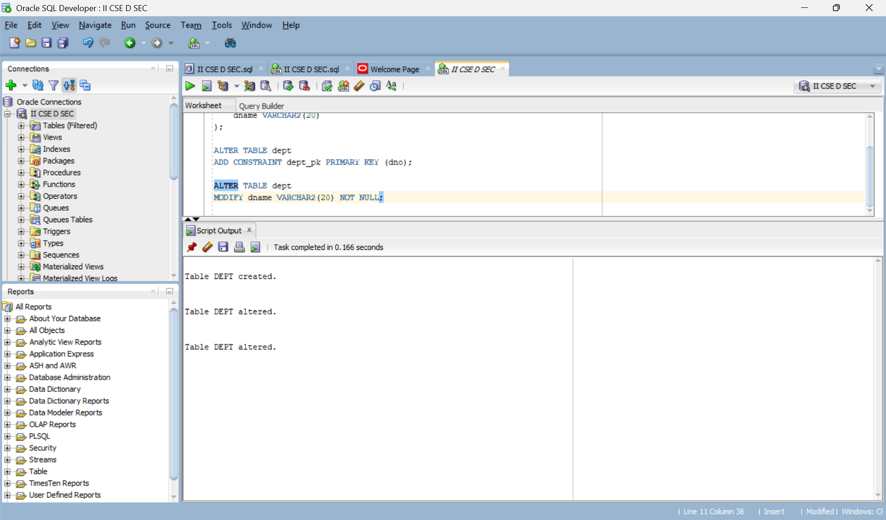


#(4) 3. Create a student table having sid, sname, did as columns.

```
CREATE TABLE student (
    sid NUMBER,
    sname VARCHAR2(20),
    did NUMBER
);

```
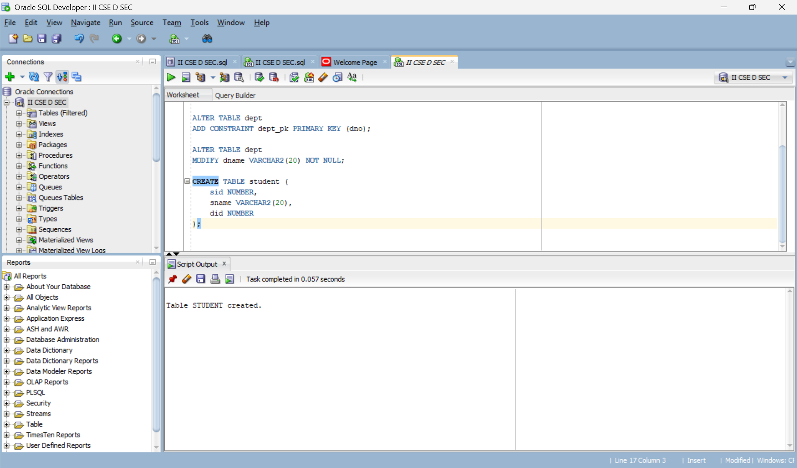

#(4) 4. Apply appropriate constraints on student table.

```
ALTER TABLE student
ADD CONSTRAINT student_pk PRIMARY KEY (sid);

ALTER TABLE student
MODIFY sname VARCHAR2(20) NOT NULL;

ALTER TABLE student
ADD CONSTRAINT student_dept_fk
FOREIGN KEY (did) REFERENCES dept(dno);

```
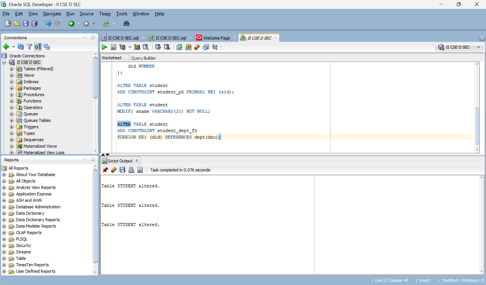

#(4) 5. Insert 7 records into dept table.

```
INSERT INTO dept VALUES (1, 'CSE');
INSERT INTO dept VALUES (2, 'ME');
INSERT INTO dept VALUES (3, 'CE');
INSERT INTO dept VALUES (4, 'EEE');
INSERT INTO dept VALUES (5, 'ECE');
INSERT INTO dept VALUES (6, 'CSM');
INSERT INTO dept VALUES (7, 'CSD');

```
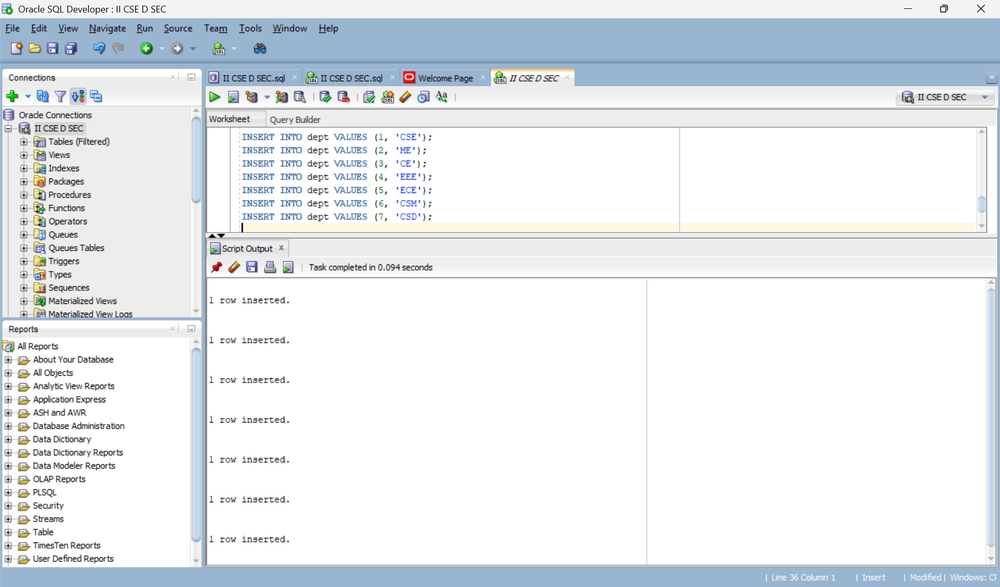

#(4) 6. Insert at least 10 records into student table.

```
INSERT INTO student VALUES (101, 'Ravi', 1);
INSERT INTO student VALUES (102, 'Anita', 2);
INSERT INTO student VALUES (103, 'Kiran', 3);
INSERT INTO student VALUES (104, 'Priya', 4);
INSERT INTO student VALUES (105, 'Arjun', 5);
INSERT INTO student VALUES (106, 'Sneha', 6);
INSERT INTO student VALUES (107, 'Rahul', 7);
INSERT INTO student VALUES (108, 'Divya', 1);
INSERT INTO student VALUES (109, 'Vijay', 2);
INSERT INTO student VALUES (110, 'Meena', 3);

```
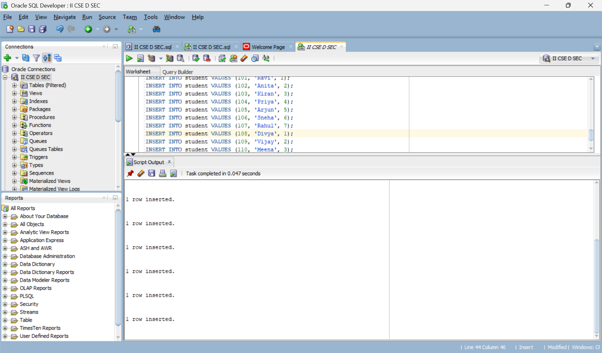

#(4) 7. Write a SQL Query to Implement NATURAL JOIN between Student and Dept.

```
SELECT *
FROM student
JOIN dept
ON student.did = dept.dno;

```
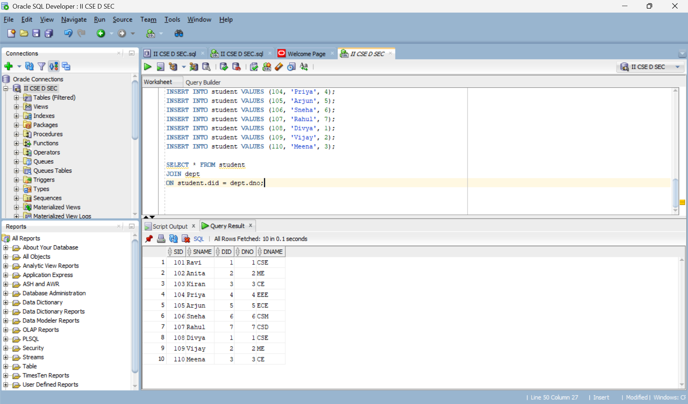

#(4) 8. Write a SQL Query to Implement EQUI JOIN between Student and Dept.

```
SELECT *
FROM student, dept
WHERE student.did = dept.dno;

```
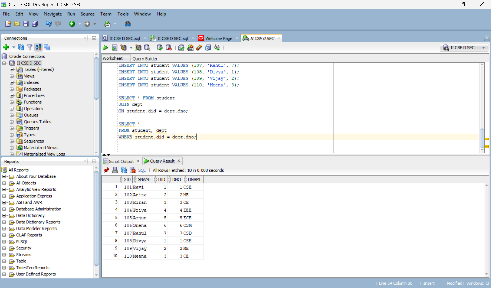

#(4) 9. Write a SQL Query to Implement CONDITIONAL JOIN between Student and Dept.

```
SELECT *
FROM student, dept
WHERE student.did > dept.dno;

```


#(4) 10. Write a SQL Query to Implement LEFT OUTER NATURAL JOIN between Student and Dept.

```
SELECT *
FROM student
LEFT OUTER JOIN dept
ON student.did = dept.dno;

```
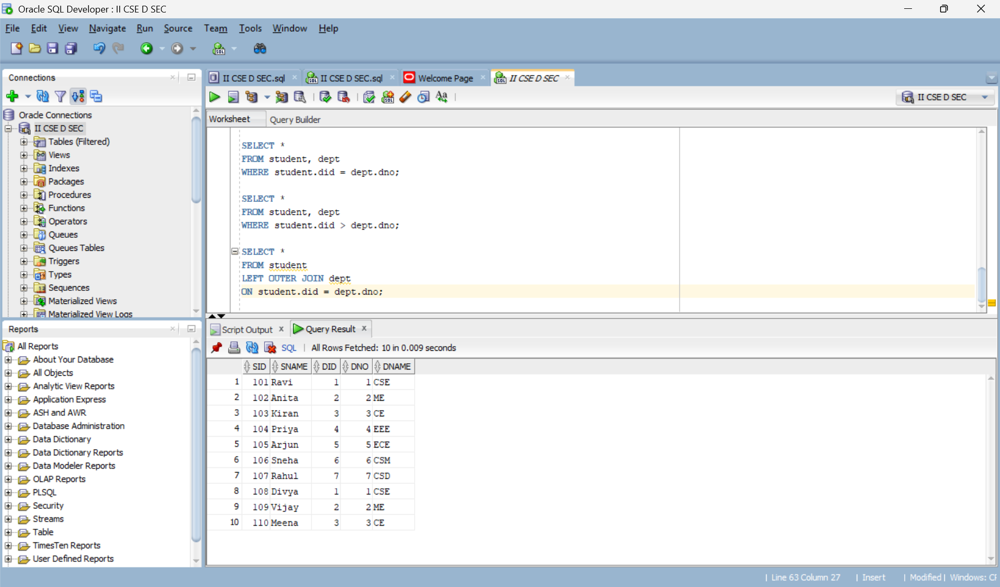

#(4) 11. Write a SQL Query to Implement RIGHT OUTER NATURAL JOIN between Student and Dept.

```
SELECT *
FROM student
RIGHT OUTER JOIN dept
ON student.did = dept.dno;

```
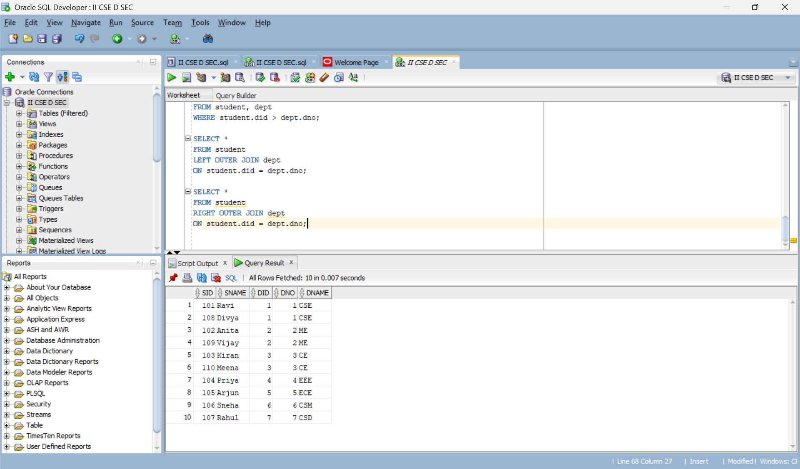

#(4) 12. Write a SQL Query to Implement FULL OUTER NATURAL JOIN between Student and Dept.

```
SELECT *
FROM student
FULL OUTER JOIN dept
ON student.did = dept.dno;

```


#(4) 13. Write a SQL Query to Implement LEFT OUTER EQUI JOIN between Student and Dept.

```
SELECT *
FROM student
LEFT OUTER JOIN dept
ON student.did = dept.dno;

```


#(4) 14. Write a SQL Query to Implement RIGHT OUTER EQUI JOIN between Student and Dept.

```
SELECT *
FROM student
RIGHT OUTER JOIN dept
ON student.did = dept.dno;

```


#(4) 15. Write a SQL Query to Implement FULL OUTER EQUI JOIN between Student and Dept.

```
SELECT *
FROM student
FULL OUTER JOIN dept
ON student.did = dept.dno;

```


#(4) 16. Write a SQL Query to Implement LEFT OUTER CONDITIONAL JOIN between Student and Dept.

```
SELECT *
FROM student
LEFT OUTER JOIN dept
ON student.did > dept.dno;

```
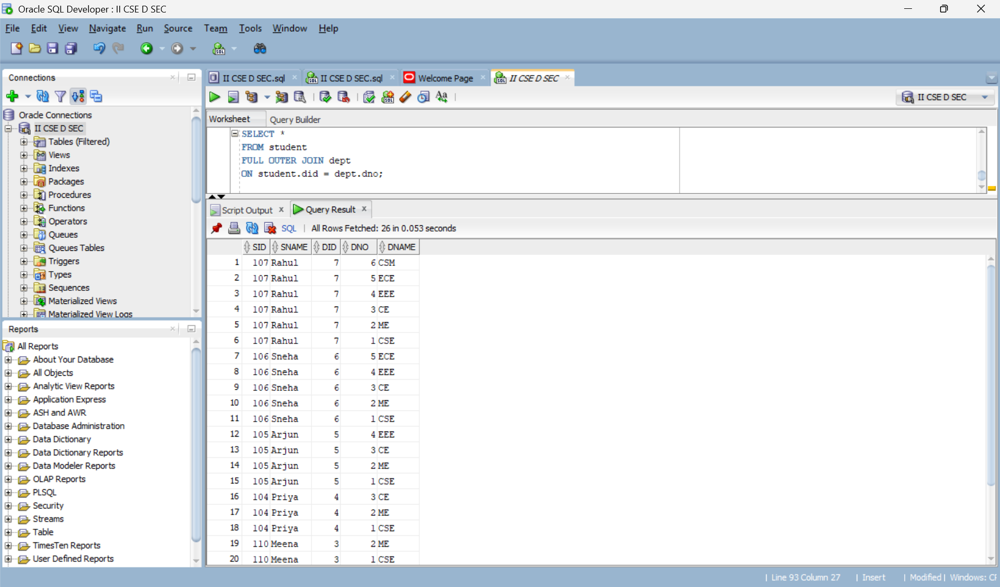

#(4) 17. Write a SQL Query to Implement RIGHT OUTER CONDITIONAL JOIN between Student and Dept.

```
SELECT *
FROM student
RIGHT OUTER JOIN dept
ON student.did > dept.dno;

```
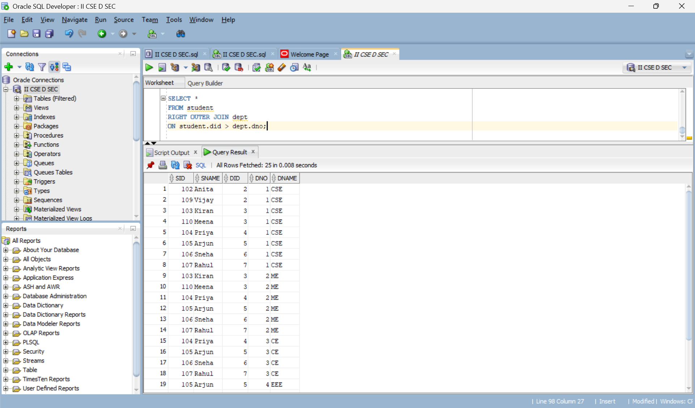

#(4) 18. Write a SQL Query to Implement FULL OUTER CONDITIONAL JOIN between Student and Dept.

```
SELECT *
FROM student
FULL OUTER JOIN dept
ON student.did > dept.dno;

```
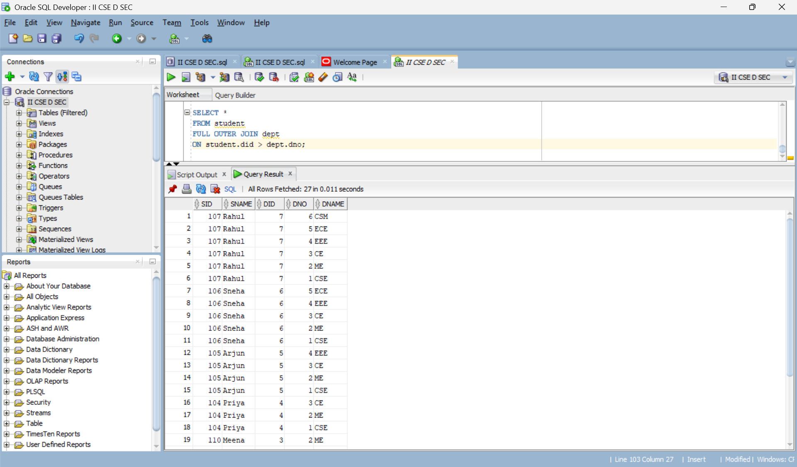

#(4) 19. Write a SQL Query to Implement CROSS JOIN between Student and Dept.

```
SELECT *
FROM student
CROSS JOIN dept;

```


